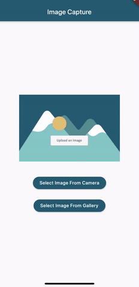

# Image Capture 📷

An Image Capture app that allows the user to upload an image to the app by either (1) accessing their camera to take a picture or (2) through their Photos (iOS) / Gallery (Android). This app utilizes the Flutter package Image_Picker to access the device's pictures and camera (with the user's permission of course).

Thanks [Sara Holburt](https://dribbble.com/saraholburt) for the image placeholder design.
